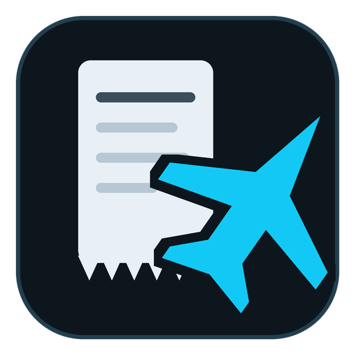
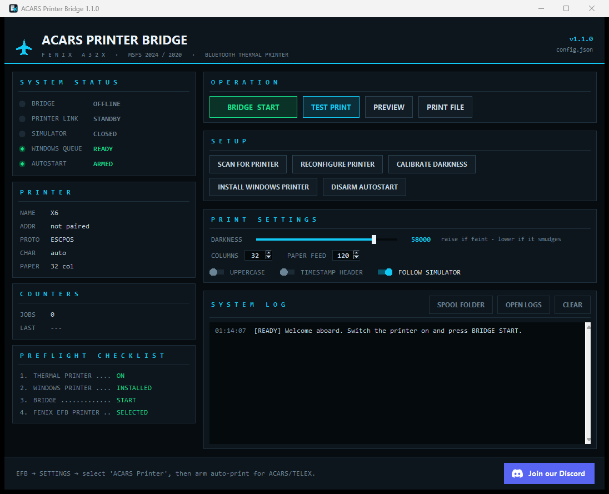
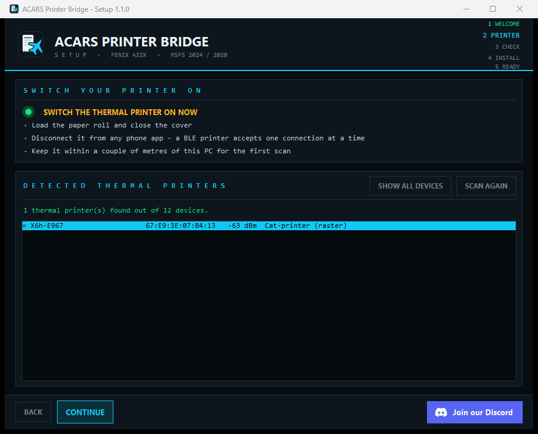

<div align="center">



# ACARS Printer Bridge

**Print your Fenix A32X ACARS and TELEX messages on a cheap Bluetooth thermal printer.**

[](https://www.python.org/downloads/)
[](#requirements)
[](LICENSE)
[](https://discord.gg/bFY5wCf6CK)

Microsoft Flight Simulator 2024 / 2020 · Fenix A319 / A320 / A321



</div>

---

## Why this exists

You bought a pocket thermal printer to get real paper ACARS in the cockpit, and it does not
work. Three walls stand in the way, and this app knocks all three down.

| Wall | What actually happens |
|---|---|
| **1. The Fenix only prints to Windows printers** | The EFB printer list is the Windows printer list. If your printer is not in it, the aircraft cannot use it. |
| **2. Your printer is not a Windows printer** | It shows up under Bluetooth devices but never "connects", because it exposes no printer profile (HCRP/BIP) and has no driver. It is a **Bluetooth Low Energy** device that takes commands on a GATT characteristic. No amount of pairing will make it appear under Printers. |
| **3. Many of them do not even speak ESC/POS** | The X6/X6h class belongs to the *cat printer* family (service `AE30`, characteristic `AE01`): no built-in fonts, no text mode - they accept **images only**, one 384-dot row at a time, wrapped in binary packets with a CRC8. |

The bridge creates a virtual Windows printer the EFB can see, catches the print job, draws the
message as a bitmap and speaks the printer's native protocol over Bluetooth LE.

```
Fenix A32X EFB ──▶ Windows printer "ACARS Printer" ──▶ RAW 127.0.0.1:9100
                                                              │
                                                    ACARS Printer Bridge
                                                              │
                              Bluetooth LE · cat-printer or ESC/POS ──▶ your printer
```

## Install

### The easy way: the installer

Download **`APBinstaller.exe`** from the [latest release](../../releases/latest) and run it. No
Python, no command line.

<div align="center"></div>

The wizard walks you through five steps:

1. **Welcome** - pick the install folder (defaults to `%LOCALAPPDATA%\Programs\ACARS Printer Bridge`).
2. **Printer** - it tells you to *switch the thermal printer on*, then scans and shows only the
   devices that really are thermal printers, best match first. Earbuds, TVs and phones are
   filtered out.
3. **Check** - connects to the printer, confirms the write characteristic, prints a test page and
   lets you tune the darkness right there.
4. **Install** - downloads `APB.exe`, creates the desktop and Start Menu shortcuts, creates the
   Windows printer (one UAC prompt) and arms the startup entry.
5. **Ready** - launches the app.

Nothing is written outside the install folder, your Startup folder and `%LOCALAPPDATA%`.
Administrator rights are requested only for the Windows printer.

### From source

```bat
git clone https://github.com/FlippyMich/acars-printer-bridge.git
cd acars-printer-bridge
setup.bat
```

Then `start.bat` for the app, `cli.bat <command>` for the command line. `pip install .` also
works and gives you the `acars-bridge` / `acars-bridge-ui` entry points.

## Requirements

- Windows 10 or 11 (the app drives the Windows print spooler and WinRT Bluetooth)
- A Bluetooth 4.0+ adapter
- Fenix A32X **v2.2.0.351 or newer** (the build that added physical ACARS printer support) with
  MSFS 2024 or 2020
- Python 3.10+ *only if you run from source* - `APB.exe` bundles its own

## Supported printers

| Family | Detected by | Protocol | Status |
|---|---|---|---|
| X6, X6h, GB01, GB02, GT01, MX05, MX06, YHK, Phomemo-style and clones | services `AE30`/`AF30`, or the model name | cat-printer raster | **Verified on X6h** |
| Generic BLE ESC/POS (Goojprt, Zjiang, XPrinter, MTP, RPP, ISSC/Microchip UART, HM-10) | services `18F0`, `FF00`, `FFE0`, `49535343-…`, or the name | ESC/POS text | Implemented, reports welcome |
| Classic Bluetooth (SPP) printers on a COM port | Windows serial port | ESC/POS text | `"transport": "serial"` |

Paper: 58 mm (384 dots, 32 columns) by default; 80 mm works by setting `format.columns` to 48.

## First flight

1. Switch the printer on, paper loaded, **not** connected to any phone app - a BLE device
   accepts one connection at a time.
2. Open the app (it is already installed if you used the wizard) and press **TEST PRINT** to
   confirm the link.
3. In the aircraft: **EFB → Settings → printer → `ACARS Printer`**, then enable auto-print for
   ACARS and/or TELEX. You can also print any message from the MCDU (`AOC → RCVD MSGS → PRINT`).
4. Press **BRIDGE START**. With *FOLLOW SIMULATOR* on (default) the bridge waits for MSFS and
   manages itself; the startup entry does the same after every sign-in.

If the bridge is not running, Windows keeps the job spooled and prints it as soon as it comes
up - nothing is lost. Every printout is also archived as text in `logs/jobs/`.

## Changing printer later

Bought a different printer, or paired the wrong device? Two ways:

- In the app: **RECONFIGURE PRINTER** - forgets the stored address and characteristic, then
  scans again.
- Re-run the whole wizard: `APB.exe setup` (or run `APBinstaller.exe` again).

Either way the new printer's protocol is re-detected, so an ESC/POS device works just as well as
a cat printer.

## The panel

| Panel | What it tells you |
|---|---|
| **SYSTEM STATUS** | `BRIDGE` offline/armed/online · `PRINTER LINK` connected/waiting · `SIMULATOR` running/closed · `WINDOWS QUEUE` whether the virtual printer exists · `AUTOSTART` armed/disarmed |
| **PRINTER** | Name, BLE address, protocol in use, write characteristic, paper width |
| **COUNTERS** | Jobs printed this session and the time of the last one |
| **PREFLIGHT CHECKLIST** | The four things that must be true before you fly |
| **OPERATION** | Start/stop the bridge, test page, PNG preview, print a text file |
| **SETUP** | Scan, reconfigure, darkness calibration, Windows printer, autostart |
| **PRINT SETTINGS** | Darkness, columns, paper feed, uppercase, timestamp header, follow-simulator - saved as you change them |
| **SYSTEM LOG** | Everything the bridge does, colour-coded, with shortcuts to the spool and log folders |

Drop a `.txt` in the spool folder (button in the log panel) to print anything else: SimBrief
OFPs, clearances, checklists.

## Where things live

| | Installed via the wizard | From source |
|---|---|---|
| App | `%LOCALAPPDATA%\Programs\ACARS Printer Bridge\APB.exe` | the checkout |
| Settings | `%LOCALAPPDATA%\ACARS Printer Bridge\config.json` | `config.json` in the checkout |
| Logs, job archive, spool | `%LOCALAPPDATA%\ACARS Printer Bridge\` | `logs\`, `spool\` |
| Startup entry | `shell:startup\ACARS Bridge.lnk` → `APB.exe watch-sim` | → `pythonw -m acars_bridge watch-sim` |

Only one bridge may run at a time - two would fight over port 9100 and over the printer - so a
loopback lock port (`lock_port`, default 49321) enforces it. If the background watcher is
running when you press **BRIDGE START**, the app offers to stop it and take over.

To uninstall: **DISARM AUTOSTART** in the app, delete the shortcuts and the install folder
(`UNINSTALL.txt` in there spells it out), and optionally remove the `ACARS Printer` queue.

## Configuration

Start from [`config.example.json`](config.example.json). Everything has a sane default.

| Key | Default | Meaning |
|---|---|---|
| `transport` | `"ble"` | `ble`, `serial` (SPP on a COM port) or `file` (debug sink) |
| `protocol` | `"auto"` | `auto`, `catprinter` or `escpos` |
| `ble.address` | `null` | Set by the scan; `null` falls back to `ble.name_filter` |
| `ble.write_char_uuid` | `null` | Characteristic to write to; `null` auto-detects |
| `ble.chunk_size` / `chunk_delay_ms` | `180` / `20` | Lower / raise these if a printout breaks up |
| `catprinter.energy` | `58000` | Darkness, 0-65535. Raise if faint, lower if it smudges |
| `catprinter.feed_steps` | `120` | Paper advance after each printout |
| `catprinter.compress` | `false` | RLE transfer: faster, not supported by every model |
| `catprinter.font` | `null` | `null` = Consolas / Lucida Console; or a path to a TTF |
| `format.columns` | `32` | `32` = 58 mm, `48` = 80 mm |
| `format.uppercase` | `false` | `true` for that all-caps ACARS look |
| `format.header` | `false` | Adds a centred `ACARS` + UTC timestamp header |
| `sources.tcp.port` | `9100` | RAW port; must match the Windows printer port |
| `sources.folder.path` | `"spool"` | Watched folder for `.txt`/`.prn` files |
| `autostart.processes` | MSFS 2024 + 2020 executables | Which processes count as "the simulator" |

## Command line

`APB.exe <command>`, or `cli.bat <command>` from source. Text commands attach to the terminal
they were started from, so `APB.exe doctor > report.txt` works.

| Command | Purpose |
|---|---|
| `ui` | Open the app (default when started with no arguments) |
| `setup` | Re-run the setup wizard |
| `scan` | List nearby Bluetooth LE devices |
| `probe --address <ADDR> --save` | Dump the GATT map and store the printer |
| `test` | Print a test page |
| `preview [file]` | Render `logs/preview.png` instead of printing |
| `calibrate [levels...]` | Print samples at several darkness levels |
| `print <file>` | Print a text file |
| `run` | Run the bridge in the foreground |
| `watch-sim` | Run the bridge only while MSFS is open |
| `doctor` | Check printer, RAW port, Windows printer and autostart |

## Troubleshooting

**"Printer not found" / nothing detected.** Power-cycle it: these printers only advertise for a
few minutes after switching on. Close the vendor app on your phone. If you ever paired the
printer in Windows, **remove** it from *Settings → Bluetooth* - a half-finished pairing blocks
the connection. Then scan again.

**My printer is not recognised as a printer.** Press **SHOW ALL DEVICES** in the wizard (or pick
it from the full list in the app) and select it manually - detection is a convenience, not a
gate. Please open an issue with the name and services it advertises so it can be added.

**Print is faint, or too dark and smeared.** Use **CALIBRATE DARKNESS**, then keep the value you
like. Cheap paper often needs 62000-65535.

**Printouts break up or stall halfway.** The bridge already obeys the printer's XOn/XOff
notifications. If it still happens, lower `ble.chunk_size` to 100 and raise
`ble.chunk_delay_ms` to 40.

**Nothing comes out although the log says bytes were sent.** Your model may want
`catprinter.drawing_mode` set to `"image"`. Check the log for status warnings such as *out of
paper* or *cover open*.

**The EFB does not list `ACARS Printer`.** Restart MSFS after creating it, and confirm with
`APB.exe doctor` that it exists on port `ACARS_RAW_9100`.

**"RAW port 9100 in use".** Another bridge instance is running (background watcher?), or another
program owns 9100. Change `sources.tcp.port` **and** recreate the Windows printer with the same
number.

**The installer cannot download APB.exe.** Put `APB.exe` next to `APBinstaller.exe` and run it
again - a local copy is always preferred over the download.

**Bluetooth sanity check.**
`powershell -ExecutionPolicy Bypass -File tools\bluetooth_diagnostics.ps1` lists adapters,
paired devices, Bluetooth COM ports and installed printers. A COM port there means your printer
is classic-Bluetooth: set `"transport": "serial"` and the right `serial.port`.

## How it works

**Cat-printer protocol.** Packets are `0x51 0x78 <cmd> 0x00 <len_lo> <len_hi> <payload> <crc8>
0xFF`, with a CRC8 (polynomial 0x07) over the payload. A printout is: device state → quality →
energy → drawing mode → lattice start → one `0xA2` packet per 384-dot row (LSB first, optional
`0xBF` run-length form) → feed → lattice end. The printer pushes `0xAE` notifications on
characteristic `AE02` to pause (`0x10`) and resume (`0x00`) the stream, and `0xA3` replies carry
paper/cover/temperature/battery bits. Command constants are pinned by unit tests against the
reference implementation, [rbaron/catprinter](https://github.com/rbaron/catprinter), and the
[protocol notes](https://github.com/fulda1/Thermal_Printer/wiki/Cat-printer-protocol).

**Text to dots.** These printers have no fonts, so `raster.py` measures a monospaced font until
`columns` characters fill exactly 384 dots, draws the page with Pillow and thresholds it to
1-bit rows.

**Catching the job.** The Windows printer uses the in-box *Generic / Text Only* driver on a
Standard TCP/IP RAW port pointed at `127.0.0.1:9100`. The bridge is that RAW server: it reads a
job until the spooler closes the socket (or until silence, for monitors that keep it open),
strips the driver's control sequences, re-flows the text and prints it.

**Detection.** `printers.py` scores each BLE device on the services it advertises and on its
name, with a deny-list for earbuds, TVs, phones and sensors. 60% or more counts as a printer;
services and name agreeing gives 99%.

## Development

```bat
setup.bat
.venv\Scripts\python.exe -m pip install -r requirements-dev.txt
```

Test suites - none of them need the printer (they use `"transport": "file"`); the two UI ones
need a desktop session:

```bat
.venv\Scripts\python.exe tests\test_protocol.py   :: protocol, layout, rasterizer
.venv\Scripts\python.exe tests\test_bridge.py     :: bridge end-to-end
.venv\Scripts\python.exe tests\test_watcher.py    :: simulator watcher + instance lock
.venv\Scripts\python.exe tests\test_setup.py      :: printer detection + installer helpers
.venv\Scripts\python.exe tests\test_ui.py         :: app wiring
.venv\Scripts\python.exe tests\test_wizard.py     :: installer wizard wiring
```

Build the executables and regenerate the icons:

```bat
.venv\Scripts\python.exe tools\build_assets.py    :: logo, .ico, Discord mark
.venv\Scripts\python.exe tools\build_exe.py       :: dist\APB.exe + dist\APBinstaller.exe
```

**Before publishing a release**, set `DEFAULT_DOWNLOAD_URL` in
[`acars_bridge/installer.py`](acars_bridge/installer.py) to your own release asset, rebuild the
installer, and upload both `APB.exe` and `APBinstaller.exe` to the release.

```
acars_bridge/
  bridge.py      job queue, rendering, delivery
  catprinter.py  cat-printer protocol: packets, CRC8, bitmap rows, energy, feed
  escpos.py      ESC/POS commands and shared text layout
  raster.py      text to 384-dot bitmap rows (Pillow)
  printers.py    thermal printer detection and scoring
  transport.py   BLE GATT (with flow control), serial SPP, file sink
  sources.py     RAW 9100 server and watched folder
  watcher.py     follow the simulator, single-instance lock
  system.py      Windows printer, autostart, process checks
  installer.py   download APB.exe, shortcuts, install folder
  cli.py         command line
  ui/            app window, setup wizard, theme, widgets, async runtime
tools/           asset builder, exe builder, screenshot helper, BT diagnostics
tests/           six test suites
```

Pull requests are welcome - especially reports from other printer models. Keep the line length
at 100 and run the suites before opening one.

## Credits

- [rbaron/catprinter](https://github.com/rbaron/catprinter) and
  [NaitLee/Cat-Printer](https://github.com/NaitLee/Cat-Printer) for the reverse-engineered
  protocol this implementation is verified against
- [bleak](https://github.com/hbldh/bleak) for cross-platform BLE
- The Discord mark is rasterized from [simple-icons](https://github.com/simple-icons/simple-icons)
  (CC0), used only to link to our own server

Not affiliated with Fenix Simulations, Microsoft or Discord.

## License

[MIT](LICENSE)

<div align="center">

**Questions, printer reports, screenshots of your cockpit?**

[](https://discord.gg/bFY5wCf6CK)

</div>
